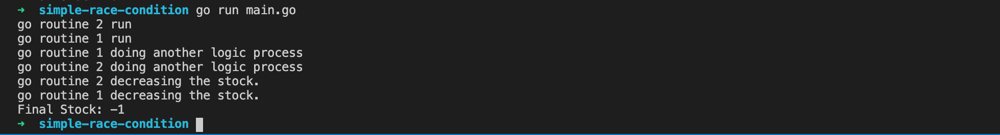
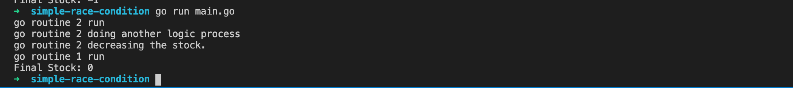
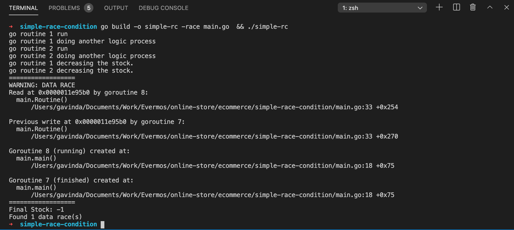
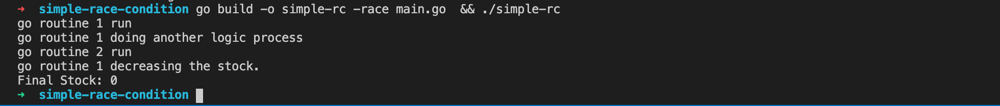

# Ecommerce concurrency stock handling

Hi, Gavin here. In this repo, I will explain to you how to handle stock with concurent connection request. As we know, ecommerce become a famous platform for buying something online. Lot of discount, flash sale event, cashback and many more. Have you ever think about how they handle stock items during a flash sale event ?

## The problem

Let's pick 1 case. Flash sale. They have limited stock and thousand or even million people want to buy some product. For example, an Ecommerce selling 3 unit of iPhone 12 for Rp 12. Imagine if million of people start hit the checkout button and the stock handling is so dumb. What will happen ? Yes, **a negative stock**. So, what's the cause ? Simple answer, **Race Condition**. A race condition occurs when multiple threads/request accessing the same data and they try to modify it at the same time. Race condition also can happen in the database side. Why ? because from add to cart until payment process, there are lot of database query according to the stock. The solution is using **Database Row Locking**.

## Talk is cheap show me the code

Alright, calm down guys. Let me show you how to reproduce the bug.

### Race condition

At this time, I will using Golang, because this language have a built-in race detector. This is a simple version of race condition. Im using 2 [go routines](https://tour.golang.org/concurrency/1) to simulate a concurency request. The scenario is 2 people trying to buy an item at the same time. Here is the steps :

1. Clone this repo.
2. Run `cd ecommerce/simple-race-condition/`.
3. Run `go run main.go`

It will display the output like this :

Or like this

The last one is the best case. The stock become 0 as expected. But, the first one is the worst case, each goroutine is decreasing the stock and it become negative. If we build the binary using `-race` argument and run the binary, it will show you the data race warning.
Try to run `go build -o simple-rc -race main.go  && ./simple-rc`. You will see the warning like this :

The solution is adding the [Mutual Exclusion](https://yourbasic.org/golang/mutex-explained/). Open file `main.go`, then uncomment line 12, 28, and 36. Then try run `go build -o simple-rc -race main.go  && ./simple-rc` again. The warning is gone and the final stock is zero as we expected. Problem solved.

## Database Row Locking

