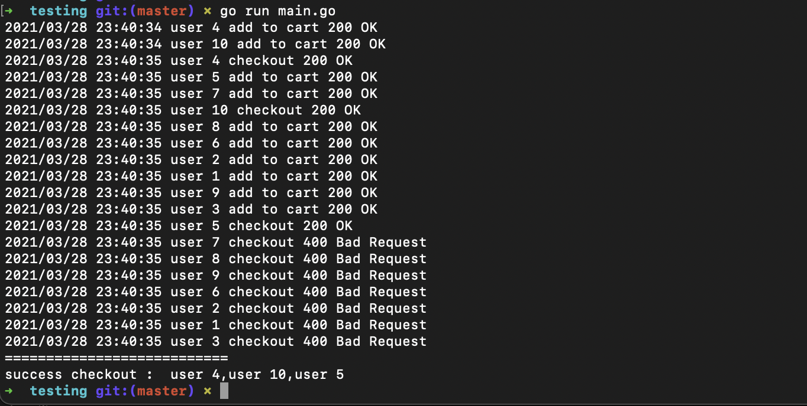
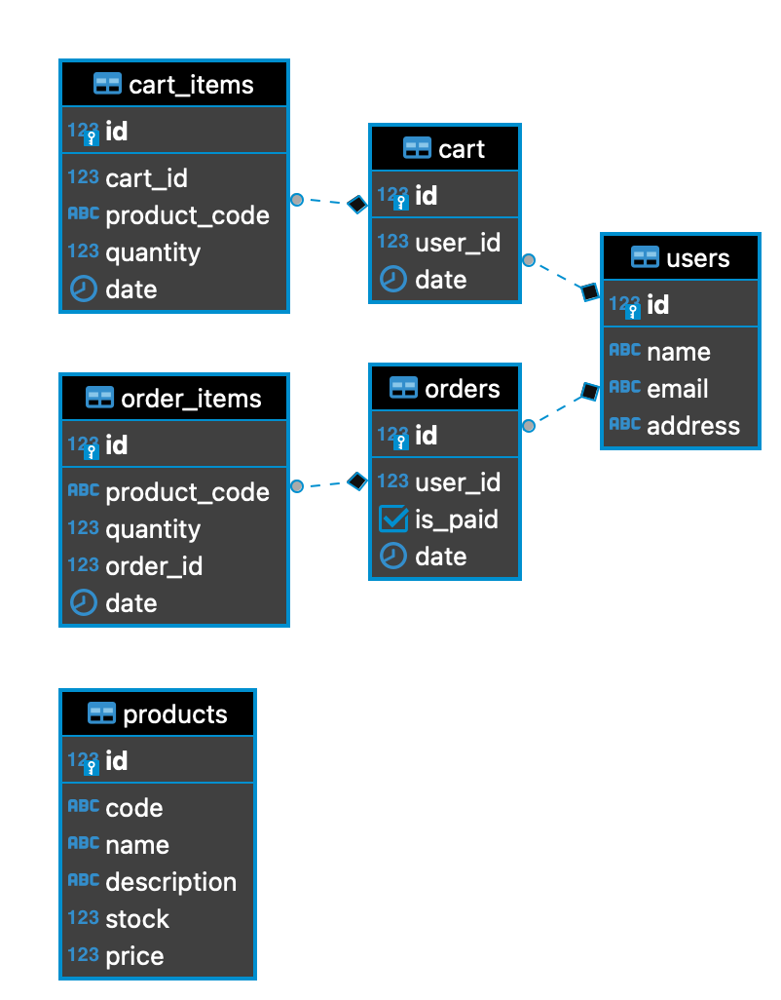

# Ecommerce concurrency stock handling

Hi, Gavin here. In this repo, I will explain to you how to handle stock with concurent connection request. As we know, ecommerce become a famous platform for buying something online. Lot of discount, flash sale event, cashback and many more. Have you ever think about how they handle stock items during a flash sale event ?

## The problem

Let's pick 1 case. Flash sale. They have limited stock and thousand or even million people want to buy some product. For example, an Ecommerce selling 3 unit of iPhone 12 for Rp 12. Imagine if million of people start hit the checkout button and the stock handling is so dumb. What will happen ? Yes, **a negative stock**. So, what's the cause ? There are a few reasons.

- Bad stock checking in important endpoint, ex: add to cart and checkout.
- Not using database transaction. Imagine, in the middle of add order and update stock, an error occur. How we cancel the query if we not using a transaction.
- Not implement **row locking transaction**. This advanced problem only happen when 2 or more request coming at the same time. You can read more, [here](https://medium.com/easyread/today-i-learned-row-locking-transaction-pada-postgresql-f8dee8084f90).
- The value of variable changed because **race condition** happen. A race condition occurs when multiple threads/process accessing the same data and they try to modify it at the same time. For example, you save the stock value in a variable, somehow multiple goroutine suddenly change this value. Then you submit this stock value to database.

## Talk is cheap show me the code

Alright, calm down guys. Let me show you how to reproduce the bug.

### Race condition

At this time, I will using Golang, because this language have a built-in race detector. This is a simple version of race condition. Im using 2 [go routines](https://tour.golang.org/concurrency/1) to simulate a concurency request. The scenario is 2 people trying to buy an item at the same time. Here is the steps :

1. Clone this repo.
2. Run `cd ecommerce/simple-race-condition/`.
3. Run `go run main.go`

It will display the output like this :


Or like this


The last one is the best case. The stock become 0 as expected. But, the first one is the worst case, each goroutine is decreasing the stock and it become negative. If we build the binary using `-race` argument and run the binary, it will show you the data race warning.
Try to run `go build -o simple-rc -race main.go  && ./simple-rc`. You will see the warning like this :


The solution is adding the [Mutual Exclusion](https://yourbasic.org/golang/mutex-explained/). Open file `main.go`, then uncomment line 12, 28, and 36. Then try run `go build -o simple-rc -race main.go  && ./simple-rc` again. The warning is gone and the final stock is zero as we expected. Problem solved.


### Row Locking Transaction

Without further-ado, let's move into `./ecommerce/database-row-locking` folder. This is a simple version of backend system of Ecommerce.

#### How to run

Using docker :

- Start your docker.
- Run `docker-compose up`. Wait until the database and app running up.
- The app running at `localhost:5050` and the Postgres running at port `5433`. You can change the port at `docker-compose.yaml` file.

Without docker :

- Copy paste `.env.sample` to `.env`. Adjust your database inside `.env` file.
- Import the `setup.sql` file into your database.
- Run `go run app/main.go`.

#### Concurrent test

Ok we have our application running. So, how do we test using concurrent connection. Take a look inside folder `/ecommerce/testing`. You will find 1 file `main.go`. Just run it `go run main.go`. This will simulate 10 people trying to buy a product which have only 3 stocks.



As you can see, only 3 users success doing checkout process.

#### Unit test

Im sorry due to time limit, I cannot write the unit test, but if you want to know how Im write the unit test for the same architecture like this, see [this repo](https://github.com/vinbyte/movies).

#### Explanation

So, in this app Im implement :
- Clean architecture. [See](./ecommerce/database-row-locking/app/main.go)
- Stock checking in [cart](./ecommerce/database-row-locking/orders/usecase/add_cart.go#L127) and [checkout](./ecommerce/database-row-locking/orders/usecase/checkout.go#L99) endpoint.
- DB Transactions included. [See](./ecommerce/database-row-locking/orders/usecase/add_cart.go#L96)
- Row locking transaction. [See](./ecommerce/database-row-locking/orders/repository/postgres/get_cart_data.go#L14)

To perform row locking, basically you just add `FOR UPDATE` at the end of `SELECT` query. This will blocking other transaction, until the current one is finished. You are safe to read the data, without worry another transaction that will do the update query.
The database schema :



You will notice, why Im separate the `products` tabel, right ? This is good for database scalability. For example, if you want to move the `products` data into the other database, you dont need to worry about `products.id`. Im using the `products.code` instead as a unique value.
The endpoints :

| url | method | desc |
| --- | --- | --- |
| `/` | GET | the root endpoint |
| `/v1/products` | GET | product list |
| `/v1/cart/add` | POST | add to cart |
| `/v1/checkout` | POST | checkout endpoint |
| `/v1/reset` | GET | endpoint helper to reset the stock and clear cart and order |

API Docs : <https://vin.gg/ecommerceapidocs>

## Bonus : A Treasure Hunt

### Overview

- Given the following layout

```
########
#......#
#.###..#
#...#.##
#X#....#
########
```
- `#` represents an obstacle. `.` represents a clear path. `X` represents the player’s starting position.
- A treasure is hidden within one of the clear path points, and the user must find it.
- From the starting position, **the user must navigate in a specific order:
Up/North A step(s), then
Right/East B step(s), then
Down/South C step(s)**.
- The possible treasure marked with `$` sign.

Output a list of probable coordinate points where the treasure might be located.

### Run the code

- Enter to the folder at `/treasure-hunt`.
- Run `go run main.go`
- After that, you will find the final answer is :

Location 1
```
######## 
#......#
#.###..#
#...#.##
#X#$...#
########
```

Location 2
```
########
#......#
#.###$.#
#...#.##
#X#....#
########
```

Location 3
```
########
#......#
#.###..#
#...#$##
#X#....#
########
```

Location 4
```
########
#......#
#.###..#
#...#.##
#X#..$.#
########
```

Location 5
```
########
#......#
#.###.$#
#...#.##
#X#....#
########
```